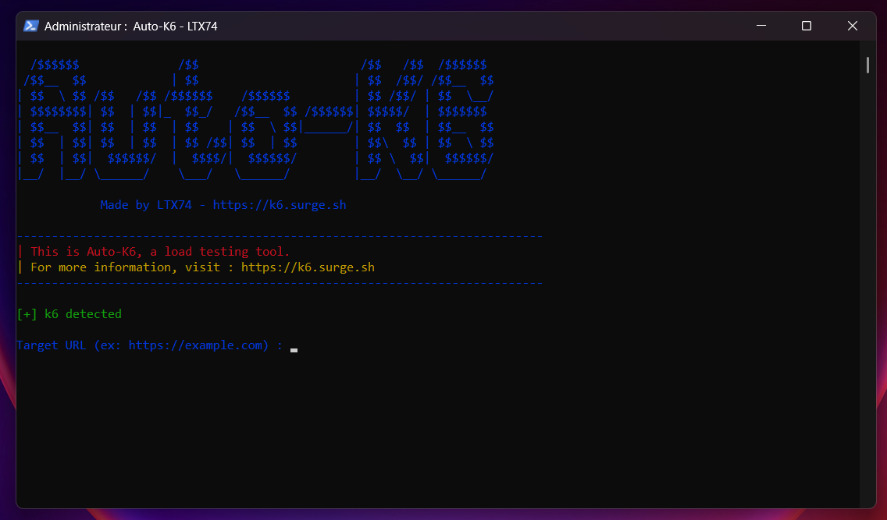
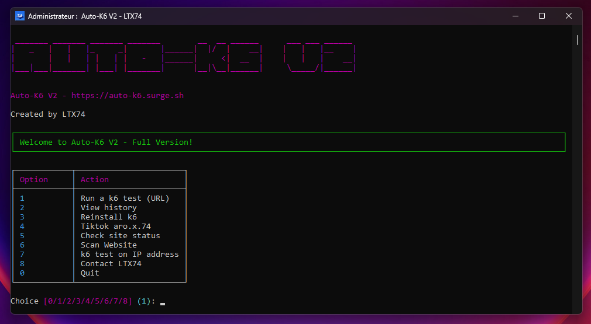

# Auto-K6

  

  <strong>A free and powerful load testing tool. Automate k6 tests with a simple CLI, an advanced GUI (V2), or a modern web interface (V3). Perfect for stress testing websites and web applications.</strong>

  

---

## 🖼️ Preview

### Basic Version (CLI)
A lightweight and fast command-line interface for quick tests.

  

### V2 Version (Advanced GUI)
A feature-rich graphical interface for in-depth analysis and control.

  

### V3 Version (Web Interface)
A modern web-based interface running locally with all advanced features.

  

---

## 🚀 Features

Available in three versions to meet all your needs:

### Basic Version
-   ✅ Simple HTTP/HTTPS load tests
-   ✅ Command line interface
-   ✅ Lightweight and quick to launch
-   ❌ Max 6500 VUs
-   ❌ Max 2 minutes per test
-   ❌ Does not save history
-   ❌ No IP address tests
-   ❌ No security scan
-   ❌ Terminal interface only

### V2 Version (Recommended)
-   ✅ Advanced and intuitive graphical interface
-   ✅ Tests on specific IP addresses
-   ✅ Integrated website security scan
-   ✅ Complete test history
-   ✅ Automatic installation of the k6 tool
-   ✅ Unlimited VUs and duration
-   ✅ Site status check
-   ✅ Priority 24/7 support
-   ✅ Free lifetime updates

### V3 Version (Ultimate - Web)
-   ✅ Beautiful and modern web interface
-   ✅ Local web server included
-   ✅ Tests on specific IP addresses
-   ✅ Advanced security scan
-   ✅ Complete test history
-   ✅ Unlimited VUs and duration
-   ✅ Real-time monitoring
-   ✅ Mobile responsive interface
-   ✅ Priority 24/7 support
-   ✅ Automatic updates

## ⬇️ Download

Download the version that best suits your needs directly from my website :
**[https://k6.surge.sh](https://k6.surge.sh)**

## 📖 Usage

   # !!! Make sure you have python installed !!!

### Basic Version
Run`setup.bat` script and follow the instructions to enter the target URL, number of virtual users (VUs), and test duration.

### V2 Version
Launch `setup.bat` and use the graphical interface to configure and run your tests in just a few clicks.

### V3 Version (Web)
Launch `setup.bat` and open http://localhost:5000 and run your test.

## ⚠️ Disclaimer

I am in no way responsible for your actions. This tool should be used legally and ethically, only on targets for which you have explicit permission.

## 👨‍💻 Author

Created with ❤️ by **LTX74**

-   Contact: [Telegram](https://t.me/LTX74)
-   Follow me: [TikTok](https://www.tiktok.com/@aro.x.74)
-   GitHub: [LTX128](https://github.com/LTX128)

---

## 🔗 Links

- 🌐 **Official Website:** [https://k6.surge.sh](https://k6.surge.sh)
- 📦 **Basic Version:** [Auto-K6.7z](https://k6.surge.sh/Auto-K6.7z)
- 🚀 **V2 Version:** [Auto-K6-V2.7z](https://k6.surge.sh/Auto-K6-V2.7z)
- 🌟 **V3 Version:** [Auto-K6-V3.7z](https://k6.surge.sh/Auto-K6-V3.7z)

## ⭐ Support

If you find this tool useful, consider giving it a star on GitHub and sharing it with others!
